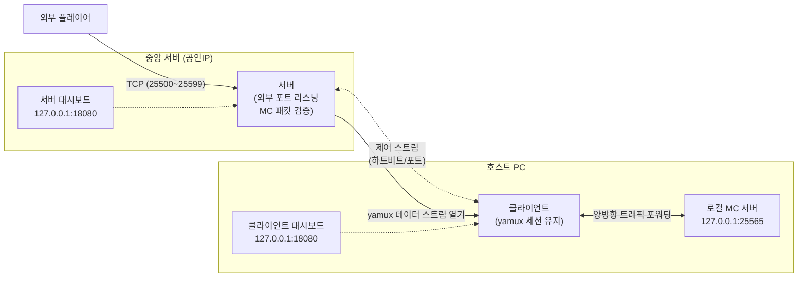

# MSPB - Minecraft Server Port Bridge
https://mspb.r-e.kr

마인크래프트 원클릭 터널링 서비스입니다. 복잡한 공유기 설정 없이 프로그램 실행 하나로 로컬 MC 서버를 외부 플레이어에게 개방합니다.

## 주요 기능

| 기능 | 설명 |
|---|---|
| **MC 패킷 검증** | 외부 접속 시 첫 패킷을 분석하여 Minecraft 핸드셰이크(0x00)일 때만 연결을 허용합니다. 비정상 트래픽은 조용히 차단됩니다. |
| **yamux 멀티플렉싱** | 단일 TCP 연결 내에서 제어 스트림(하트비트, 포트 할당)과 데이터 스트림(실제 MC 트래픽)을 분리하여 효율적으로 관리합니다. |
| **동적 포트 할당** | 클라이언트 접속 시 `25500~25599` 범위에서 외부 포트를 자동으로 할당하고, 연결 종료 시 자동 회수합니다. |
| **하트비트 & 자동 회수** | 15초 간격 Ping/Pong으로 연결 상태를 확인하고, 45초 이상 응답 없으면 자동으로 포트를 회수합니다. |
| **자동 재연결** | 클라이언트 연결이 끊기면 5초 대기 후 자동으로 서버에 재접속합니다. |
| **MC 플레이어 추적** | 로그인 패킷에서 플레이어 이름/UUID를 추출하여 대시보드에 표시합니다. 클라이언트당 최대 8명 동시 접속을 지원합니다. |
| **웹 대시보드** | 서버/클라이언트 각각 `127.0.0.1` 기반 로컬 대시보드를 제공하여 실시간 세션 상태를 모니터링할 수 있습니다. |

## 아키텍처



## 빌드

Go 1.22 이상이 필요합니다.

```bash
# 의존성 다운로드
go mod tidy

# 서버 빌드 (Windows)
CGO_ENABLED=0 GOOS=windows GOARCH=amd64 go build -o mspb-server.exe ./cmd/server

# 클라이언트 빌드 (Windows)
CGO_ENABLED=0 GOOS=windows GOARCH=amd64 go build -o mspb-client.exe ./cmd/client
```

> `resources/` 디렉토리에 윈도우 아이콘과 manifest가 포함되어 있어, `winres` 설정(`winres-server.yml`, `winres-client.yml`)을 통해 빌드 시 아이콘이 자동으로 적용됩니다.

## 실행

### 서버 (중앙 서버 — 공인 IP 보유 머신)

```bash
./mspb-server
```

서버 시작 시 다음을 확인하세요:
- **제어 포트** `19132` — 클라이언트가 접속하는 포트 (방화벽 허용 필요)
- **외부 포트 범위** `25500~25599` — 외부 플레이어가 접속하는 포트 (방화벽 허용 필요)
- **로컬 대시보드** `http://127.0.0.1:18080/dashboard` — 관리용 (외부 미노출)

### 클라이언트 (호스트 PC)

```bash
# 기본 설정 (서버: mspb.r-e.kr:19132, MC: 127.0.0.1:25565)
./mspb-client

# 커스텀 설정
./mspb-client -server other-server.com:19132 -local 127.0.0.1:25570
```

**CLI 옵션:**

| 플래그 | 기본값 | 설명 |
|---|---|---|
| `-server` | `mspb.r-e.kr:19132` | 중앙 서버 주소. 제 3자 서버로 접속할 때는 이 값을 변경합니다. |
| `-local` | `127.0.0.1:25565` | 로컬 MC 서버 주소. MC 서버가 다른 포트에서 실행 중이면 이 값을 변경합니다. |
| `-token` | `""` | 인증 토큰 (추후 확장용, 현재 미사용) |

클라이언트 실행 후 로컬 대시보드에서 상태를 확인할 수 있습니다: `http://127.0.0.1:18080/dashboard`

## 동작 흐름

```
1. 클라이언트가 중앙 서버에 TCP 연결
2. yamux 세션 생성 (단일 연결 내 멀티플렉싱)
3. 제어 스트림에서 핸드셰이크 → 서버가 외부 포트 할당
4. 외부 플레이어가 할당된 포트로 접속
5. 서버가 첫 패킷을 Peek하여 MC 프로토콜 검증
6. 검증 통과 시 yamux 데이터 스트림 열기
7. 클라이언트가 데이터 스트림을 로컬 MC 서버에 연결
8. 양방향 트래픽 브릿지 (외부 플레이어 ↔ 로컬 MC 서버)
9. 15초마다 하트비트 Ping/Pong 전송
10. 연결 종료 시 포트 자동 회수
```

## 핵심 설계

| 기능 | 구현 |
|---|---|
| 멀티플렉싱 | hashicorp/yamux — 단일 TCP 내 control + data 스트림 분리 |
| 패킷 검증 | MC VarInt 파싱 — 첫 패킷이 핸드셰이크(0x00)일 때만 통로 개방 |
| 포트 동시성 | sync.Map + CAS (LoadOrStore) — lock-free 포트 할당 |
| 하트비트 | 15초 Ping/Pong, 45초 타임아웃 시 자동 회수 |
| 자동 재연결 | 클라이언트 연결 끊김 시 5초 대기 후 재시도 |

## 프로젝트 구조

```
MSPB/
├── cmd/
│   ├── server/              # 서버 엔트리포인트
│   └── client/              # 클라이언트 엔트리포인트
├── server/
│   ├── server_main.go       # 서버 초기화 & 리스너
│   ├── tunnel_manager.go    # 터널 연결 관리, 패킷 peek, 브릿지
│   ├── port_table.go        # 동시성 안전 포트 할당 테이블
│   ├── port_table_test.go   # 포트 할당 테스트
│   ├── dashboard.go         # 서버 대시보드 HTTP 핸들러
│   └── web_server.go        # 웹 서버 (외부 대시보드)
├── client/
│   ├── client.go            # 클라이언트 로직
│   ├── cmd.go               # CLI 파싱
│   ├── dashboard.go         # 클라이언트 대시보드 HTTP 핸들러
│   ├── lock.go              # 중복 실행 방지 잠금
│   └── client-admin.html    # 클라이언트 대시보드 UI
├── shared/
│   ├── config.go            # 공통 설정 상수
│   ├── protocol.go          # 프레임 프로토콜, 하트비트
│   ├── protocol_test.go     # 프로토콜 테스트
│   ├── mc_packet.go         # MC 핸드셰이크 패킷 파싱
│   └── mc_packet_test.go    # 패킷 파싱 테스트
├── web/                     # 외부 웹 대시보드
│   ├── index.html           # 랜딩 페이지
│   ├── admin.html           # 서버 관리 대시보드
│   ├── client-admin.html    # 클라이언트 관리 대시보드
│   ├── dashboard-redirect.html
│   ├── assets/              # 정적 리소스 (아이콘 등)
│   └── downloads/           # 클라이언트 배포 파일
├── resources/               # 윈도우 리소스 (아이콘, manifest)
├── tools/
│   └── genicon/             # 아이콘 생성 유틸리티
├── go.mod
└── README.md
```

## 라이선스

Mozilla Public License 2.0 (MPL 2.0)

This Source Code Form is subject to the terms of the Mozilla Public
License, v. 2.0. If a copy of the MPL was not distributed with this
file, You can obtain one at https://mozilla.org/MPL/2.0/.
